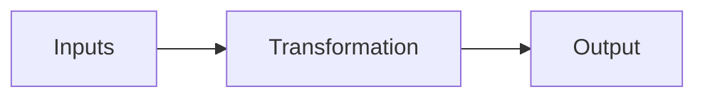

# Goods and services
- Operations of a business is different depending on whether they make goods and services
- Operations is in charge of making product which can either be goods or services
# Production Process
- The process of using resources and changing them into the final 

# ITO
Input into a transformation to create an output
# Transformation process manufacturing
- simply transformed manufacturing
- minimal processing
- basic goods easy to make and often used as inputs
- such as raw materials such as cotton steel wheat
- elaborately transformed manufactures
- complex finished goods ready for consumers or specialised use 
# Quality management
- Making sure the final products meet customer expectation
- Saves money time because they don't have to redo the product again
 Quality control
Using inspections at different points during the production process to check for faulty products
 Quality assurance
Using a system to achieve certain standards
Quality improvements
using total quality management continually focusing on improving in all business functions

JIT system
is where inputs are only ordered when they are needed and output is immediately sent to the shops where they are sold

production process
- set of steps and processes used to transform input to outputs
	- job production
	- batch production
	- flow production
quality management
- strategy that businesses use to make sure the finished product meets customer expectations
- major types of quality management
- quality control
- quality assurance
- total quality management